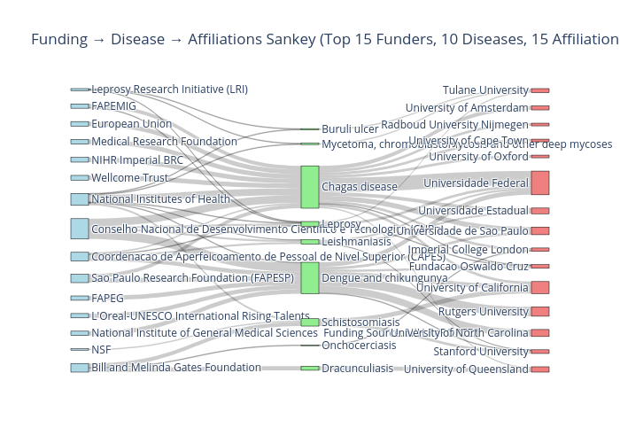

# ML Techniques in Neglected Tropical Disease Research

This project analyzes trends in machine learning techniques and funding sources in neglected tropical disease research.





## Installation

Create a new environment using Conda and install required packages with pip:

```bash
conda create -n tropical-ml python=3.10
conda activate tropical-ml
pip install -r requirements.txt
````

## Usage

```bash
jupyter notebook
```

Then open the notebook file (e.g., `Analysis.ipynb`) in your browser.